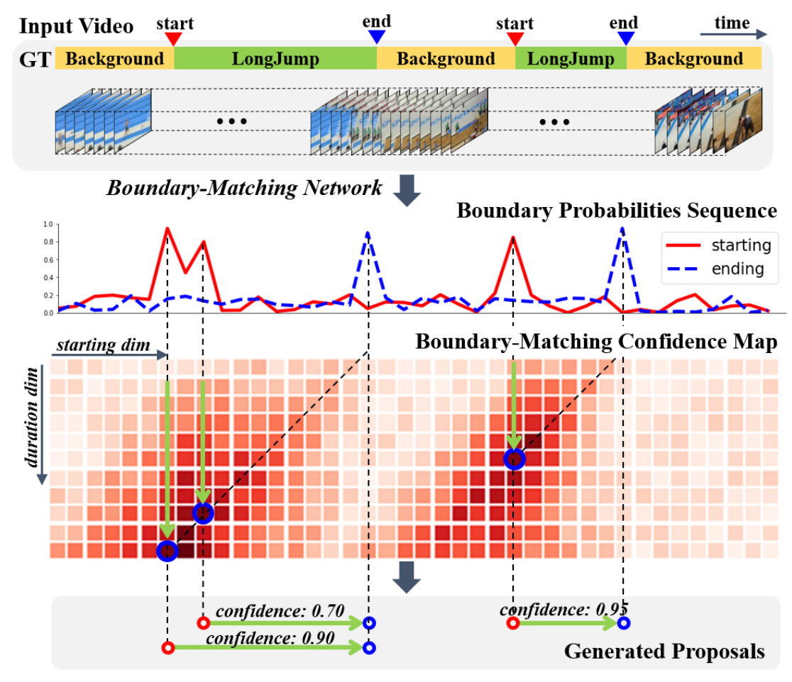

# 基于飞桨实现乒乓球时序动作定位大赛 ：B榜第10名方案


AI Stuido项目地址：

[https://aistudio.baidu.com/aistudio/projectdetail/3404593?contributionType=1](https://aistudio.baidu.com/aistudio/projectdetail/3404593?contributionType=1)

```python
# 检查数据集所在路径
!tree -L 3 /home/aistudio/data 
```

    /home/aistudio/data
    ├── data122998
    │   ├── Features_competition_train.tar.gz
    │   └── label_cls14_train.json
    └── data123009
        └── Features_competition_test_B.tar.gz
    
    2 directories, 3 files


# 准备训练集


```python
%cd /home/aistudio/data
# 创建特征数据集存放目录
%mkdir Features_train Features_test
# 分别解压缩训练和测试特征数据到各自目录下，解压完成后删除原压缩文件，节省空间
!tar -xf data122998/Features_competition_train.tar.gz -C /home/aistudio/data/Features_train --strip-components 1 && rm -rf data122998/Features_competition_train.tar.gz
# 复制训练标签到data目录下
%cp data122998/label_cls14_train.json /home/aistudio/data
```

    /home/aistudio/data


# Baseline模型BMN介绍
BMN模型是百度自研，2019年ActivityNet夺冠方案，为视频动作定位问题中proposal的生成提供高效的解决方案，在PaddlePaddle上首次开源。此模型引入边界匹配(Boundary-Matching, BM)机制来评估proposal的置信度，按照proposal开始边界的位置及其长度将所有可能存在的proposal组合成一个二维的BM置信度图，图中每个点的数值代表其所对应的proposal的置信度分数。网络由三个模块组成，基础模块作为主干网络处理输入的特征序列，TEM模块预测每一个时序位置属于动作开始、动作结束的概率，PEM模块生成BM置信度图。  
<p align="center">

</p>  

具体模型设计可参考原论文，[BMN: Boundary-Matching Network for Temporal Action Proposal Generation](https://openaccess.thecvf.com/content_ICCV_2019/papers/Lin_BMN_Boundary-Matching_Network_for_Temporal_Action_Proposal_Generation_ICCV_2019_paper.pdf), Lin et al., Baidu Inc.

# 基于PaddleVideo的BMN模型训练

本项目基于PaddleVideo项目完成识别网络训练：

* PaddleVideo "develop" branch github
* PaddlePaddle-gpu==2.1.2


```python
# 进入到PaddleVideo目录下
%cd ~/work/PaddleVideo/
```

    /home/aistudio/work/PaddleVideo


```python
# 检查源代码文件结构
!tree /home/aistudio/work/ -L 2
```

    /home/aistudio/work/
    └── PaddleVideo
        ├── applications
        ├── benchmark
        ├── configs
        ├── data
        ├── deploy
        ├── docs
        ├── inference
        ├── __init__.py
        ├── LICENSE
        ├── main.py
        ├── MANIFEST.in
        ├── output
        ├── paddlevideo
        ├── README_cn.md
        ├── README.md
        ├── requirements.txt
        ├── run.sh
        ├── setup.py
        ├── test_tipc
        └── tools
    
    12 directories, 9 files


## 配置代码环境，安装依赖库


```python
# 配置PaddleVideo环境
!python3.7 -m pip install --upgrade pip
!python3.7 -m pip install --upgrade -r requirements.txt
# 配置BMN前处理环境
# %cd ~/work/BMN/ 
# !python3.7 -m pip install --upgrade -r requirements.txt
```

    Looking in indexes: https://pypi.tuna.tsinghua.edu.cn/simple
    Requirement already satisfied: pip in /opt/conda/envs/python35-paddle120-env/lib/python3.7/site-packages (21.3.1)
    Collecting pip
      Downloading https://pypi.tuna.tsinghua.edu.cn/packages/6a/df/a6ef77a6574781a668791419ffe366c8acd1c3cf4709d210cb53cd5ce1c2/pip-22.0.3-py3-none-any.whl (2.1 MB)
         |████████████████████████████████| 2.1 MB 2.0 MB/s            
    [?25hInstalling collected packages: pip
      Attempting uninstall: pip
        Found existing installation: pip 21.3.1
        Uninstalling pip-21.3.1:
    ERROR: Could not install packages due to an OSError: [Errno 13] Permission denied: 'INSTALLER'
    Consider using the `--user` option or check the permissions.
    
    WARNING: You are using pip version 21.3.1; however, version 22.0.3 is available.
    You should consider upgrading via the '/opt/conda/envs/python35-paddle120-env/bin/python3.7 -m pip install --upgrade pip' command.
    WARNING: Ignoring invalid distribution -ip (/opt/conda/envs/python35-paddle120-env/lib/python3.7/site-packages)
    WARNING: Ignoring invalid distribution -ip (/opt/conda/envs/python35-paddle120-env/lib/python3.7/site-packages)
    Looking in indexes: https://pypi.tuna.tsinghua.edu.cn/simple
    Requirement already satisfied: numpy in /opt/conda/envs/python35-paddle120-env/lib/python3.7/site-packages (from -r requirements.txt (line 1)) (1.19.5)
    Collecting numpy
      Downloading https://pypi.tuna.tsinghua.edu.cn/packages/50/46/292cff79f5b30151b027400efdb3f740ea03271b600751b6696cf550c10d/numpy-1.21.5-cp37-cp37m-manylinux_2_12_x86_64.manylinux2010_x86_64.whl (15.7 MB)
         |████████████████████████████████| 15.7 MB 1.5 MB/s            
    [?25hRequirement already satisfied: pandas in /opt/conda/envs/python35-paddle120-env/lib/python3.7/site-packages (from -r requirements.txt (line 2)) (1.1.5)
    Collecting pandas
      Downloading https://pypi.tuna.tsinghua.edu.cn/packages/3e/0c/23764c4635dcb0a784a787498d56847b90ebf974e65f4ab4053a5d97b1a5/pandas-1.3.5-cp37-cp37m-manylinux_2_17_x86_64.manylinux2014_x86_64.whl (11.3 MB)
         |████████████████████████████████| 11.3 MB 1.2 MB/s            
    [?25hRequirement already satisfied: tqdm in /opt/conda/envs/python35-paddle120-env/lib/python3.7/site-packages (from -r requirements.txt (line 3)) (4.27.0)
    Collecting tqdm
      Downloading https://pypi.tuna.tsinghua.edu.cn/packages/81/1c/93a2b77b97cdba15a59c3d2d03e53d3292158d1106d37f579069abd90ece/tqdm-4.63.0-py2.py3-none-any.whl (76 kB)
         |████████████████████████████████| 76 kB 4.9 MB/s             
    [?25hRequirement already satisfied: PyYAML>=5.1 in /opt/conda/envs/python35-paddle120-env/lib/python3.7/site-packages (from -r requirements.txt (line 4)) (5.1.2)
    Collecting PyYAML>=5.1
      Downloading https://pypi.tuna.tsinghua.edu.cn/packages/eb/5f/6e6fe6904e1a9c67bc2ca5629a69e7a5a0b17f079da838bab98a1e548b25/PyYAML-6.0-cp37-cp37m-manylinux_2_5_x86_64.manylinux1_x86_64.manylinux_2_12_x86_64.manylinux2010_x86_64.whl (596 kB)
         |████████████████████████████████| 596 kB 2.4 MB/s            
    [?25hCollecting opencv-python==4.2.0.32
      Downloading https://pypi.tuna.tsinghua.edu.cn/packages/34/a3/403dbaef909fee9f9f6a8eaff51d44085a14e5bb1a1ff7257117d744986a/opencv_python-4.2.0.32-cp37-cp37m-manylinux1_x86_64.whl (28.2 MB)
         |████████████████████████████████| 28.2 MB 1.8 MB/s            
    [?25hCollecting decord==0.4.2
      Downloading https://pypi.tuna.tsinghua.edu.cn/packages/c0/0c/7d99cfcde7b85f80c9ea9b0b19441339ad3cef59ee7fa5386598db714efe/decord-0.4.2-py2.py3-none-manylinux1_x86_64.whl (11.8 MB)
         |████████████████████████████████| 11.8 MB 1.3 MB/s            
    [?25hCollecting av==8.0.3
      Downloading https://pypi.tuna.tsinghua.edu.cn/packages/66/ff/bacde7314c646a2bd2f240034809a10cc3f8b096751284d0828640fff3dd/av-8.0.3-cp37-cp37m-manylinux2010_x86_64.whl (37.2 MB)
         |████████████████████████████████| 37.2 MB 3.2 MB/s            
    [?25hRequirement already satisfied: scipy==1.6.3 in /opt/conda/envs/python35-paddle120-env/lib/python3.7/site-packages (from -r requirements.txt (line 8)) (1.6.3)
    Collecting ffmpeg-python==0.2.0
      Downloading https://pypi.tuna.tsinghua.edu.cn/packages/d7/0c/56be52741f75bad4dc6555991fabd2e07b432d333da82c11ad701123888a/ffmpeg_python-0.2.0-py3-none-any.whl (25 kB)
    Collecting scikit-image
      Downloading https://pypi.tuna.tsinghua.edu.cn/packages/d2/d9/d16d4cbb4840e0fb3bd329b49184d240b82b649e1bd579489394fbc85c81/scikit_image-0.19.2-cp37-cp37m-manylinux_2_12_x86_64.manylinux2010_x86_64.whl (13.5 MB)
         |████████████████████████████████| 13.5 MB 2.8 MB/s            
    [?25hRequirement already satisfied: matplotlib in /opt/conda/envs/python35-paddle120-env/lib/python3.7/site-packages (from -r requirements.txt (line 11)) (2.2.3)
    Collecting matplotlib
      Downloading https://pypi.tuna.tsinghua.edu.cn/packages/bb/eb/fb97c7c75755edf10128ae3f06ba15ffb97b852740ef9311f20113f018eb/matplotlib-3.5.1-cp37-cp37m-manylinux_2_5_x86_64.manylinux1_x86_64.whl (11.2 MB)
         |████████████████████████████████| 11.2 MB 3.0 MB/s            
    [?25hRequirement already satisfied: paddlenlp in /opt/conda/envs/python35-paddle120-env/lib/python3.7/site-packages (from -r requirements.txt (line 12)) (2.1.1)
    Collecting paddlenlp
      Downloading https://pypi.tuna.tsinghua.edu.cn/packages/2b/ec/927e81ad9c349980b1076b2721adcc3c1bbb8f0f432af21995692350c05a/paddlenlp-2.2.4-py3-none-any.whl (1.1 MB)
         |████████████████████████████████| 1.1 MB 1.9 MB/s            
    [?25hCollecting lmdb
      Downloading https://pypi.tuna.tsinghua.edu.cn/packages/4d/cf/3230b1c9b0bec406abb85a9332ba5805bdd03a1d24025c6bbcfb8ed71539/lmdb-1.3.0-cp37-cp37m-manylinux_2_12_x86_64.manylinux2010_x86_64.whl (298 kB)
         |████████████████████████████████| 298 kB 2.4 MB/s            
    [?25hCollecting SimpleITK
      Downloading https://pypi.tuna.tsinghua.edu.cn/packages/ad/ce/75d95eab0bc815f478b594add92090ff664e5cbc75ab9d8e2ffbaae1dc91/SimpleITK-2.1.1-cp37-cp37m-manylinux_2_12_x86_64.manylinux2010_x86_64.whl (48.4 MB)
         |████████████████████████████████| 48.4 MB 43 kB/s             
    [?25hRequirement already satisfied: future in /opt/conda/envs/python35-paddle120-env/lib/python3.7/site-packages (from ffmpeg-python==0.2.0->-r requirements.txt (line 9)) (0.18.0)
    Requirement already satisfied: python-dateutil>=2.7.3 in /opt/conda/envs/python35-paddle120-env/lib/python3.7/site-packages (from pandas->-r requirements.txt (line 2)) (2.8.2)
    Requirement already satisfied: pytz>=2017.3 in /opt/conda/envs/python35-paddle120-env/lib/python3.7/site-packages (from pandas->-r requirements.txt (line 2)) (2019.3)
    Collecting PyWavelets>=1.1.1
      Downloading https://pypi.tuna.tsinghua.edu.cn/packages/a1/9c/564511b6e1c4e1d835ed2d146670436036960d09339a8fa2921fe42dad08/PyWavelets-1.2.0-cp37-cp37m-manylinux_2_5_x86_64.manylinux1_x86_64.whl (6.1 MB)
         |████████████████████████████████| 6.1 MB 1.9 MB/s            
    [?25hCollecting tifffile>=2019.7.26
      Downloading https://pypi.tuna.tsinghua.edu.cn/packages/d8/38/85ae5ed77598ca90558c17a2f79ddaba33173b31cf8d8f545d34d9134f0d/tifffile-2021.11.2-py3-none-any.whl (178 kB)
         |████████████████████████████████| 178 kB 2.6 MB/s            
    [?25hRequirement already satisfied: packaging>=20.0 in /opt/conda/envs/python35-paddle120-env/lib/python3.7/site-packages (from scikit-image->-r requirements.txt (line 10)) (21.3)
    Requirement already satisfied: pillow!=7.1.0,!=7.1.1,!=8.3.0,>=6.1.0 in /opt/conda/envs/python35-paddle120-env/lib/python3.7/site-packages (from scikit-image->-r requirements.txt (line 10)) (8.2.0)
    Requirement already satisfied: networkx>=2.2 in /opt/conda/envs/python35-paddle120-env/lib/python3.7/site-packages (from scikit-image->-r requirements.txt (line 10)) (2.4)
    Requirement already satisfied: imageio>=2.4.1 in /opt/conda/envs/python35-paddle120-env/lib/python3.7/site-packages (from scikit-image->-r requirements.txt (line 10)) (2.6.1)
    Requirement already satisfied: cycler>=0.10 in /opt/conda/envs/python35-paddle120-env/lib/python3.7/site-packages (from matplotlib->-r requirements.txt (line 11)) (0.10.0)
    Requirement already satisfied: kiwisolver>=1.0.1 in /opt/conda/envs/python35-paddle120-env/lib/python3.7/site-packages (from matplotlib->-r requirements.txt (line 11)) (1.1.0)
    Requirement already satisfied: pyparsing>=2.2.1 in /opt/conda/envs/python35-paddle120-env/lib/python3.7/site-packages (from matplotlib->-r requirements.txt (line 11)) (3.0.7)
    Collecting fonttools>=4.22.0
      Downloading https://pypi.tuna.tsinghua.edu.cn/packages/1d/46/65a58d7b92905e2767000b3f6eb1d0301e9ed7d459d14461075c1db63349/fonttools-4.29.1-py3-none-any.whl (895 kB)
         |████████████████████████████████| 895 kB 1.9 MB/s            
    [?25hRequirement already satisfied: multiprocess in /opt/conda/envs/python35-paddle120-env/lib/python3.7/site-packages (from paddlenlp->-r requirements.txt (line 12)) (0.70.11.1)
    Requirement already satisfied: h5py in /opt/conda/envs/python35-paddle120-env/lib/python3.7/site-packages (from paddlenlp->-r requirements.txt (line 12)) (2.9.0)
    Requirement already satisfied: jieba in /opt/conda/envs/python35-paddle120-env/lib/python3.7/site-packages (from paddlenlp->-r requirements.txt (line 12)) (0.42.1)
    Requirement already satisfied: seqeval in /opt/conda/envs/python35-paddle120-env/lib/python3.7/site-packages (from paddlenlp->-r requirements.txt (line 12)) (1.2.2)
    Requirement already satisfied: colorama in /opt/conda/envs/python35-paddle120-env/lib/python3.7/site-packages (from paddlenlp->-r requirements.txt (line 12)) (0.4.4)
    Requirement already satisfied: colorlog in /opt/conda/envs/python35-paddle120-env/lib/python3.7/site-packages (from paddlenlp->-r requirements.txt (line 12)) (4.1.0)
    Requirement already satisfied: six in /opt/conda/envs/python35-paddle120-env/lib/python3.7/site-packages (from cycler>=0.10->matplotlib->-r requirements.txt (line 11)) (1.16.0)
    Requirement already satisfied: setuptools in /opt/conda/envs/python35-paddle120-env/lib/python3.7/site-packages (from kiwisolver>=1.0.1->matplotlib->-r requirements.txt (line 11)) (56.2.0)
    Requirement already satisfied: decorator>=4.3.0 in /opt/conda/envs/python35-paddle120-env/lib/python3.7/site-packages (from networkx>=2.2->scikit-image->-r requirements.txt (line 10)) (4.4.2)
    Requirement already satisfied: dill>=0.3.3 in /opt/conda/envs/python35-paddle120-env/lib/python3.7/site-packages (from multiprocess->paddlenlp->-r requirements.txt (line 12)) (0.3.3)
    Requirement already satisfied: scikit-learn>=0.21.3 in /opt/conda/envs/python35-paddle120-env/lib/python3.7/site-packages (from seqeval->paddlenlp->-r requirements.txt (line 12)) (0.24.2)
    Requirement already satisfied: joblib>=0.11 in /opt/conda/envs/python35-paddle120-env/lib/python3.7/site-packages (from scikit-learn>=0.21.3->seqeval->paddlenlp->-r requirements.txt (line 12)) (0.14.1)
    Requirement already satisfied: threadpoolctl>=2.0.0 in /opt/conda/envs/python35-paddle120-env/lib/python3.7/site-packages (from scikit-learn>=0.21.3->seqeval->paddlenlp->-r requirements.txt (line 12)) (2.1.0)
    WARNING: Ignoring invalid distribution -ip (/opt/conda/envs/python35-paddle120-env/lib/python3.7/site-packages)
    Installing collected packages: numpy, tifffile, PyWavelets, fonttools, tqdm, SimpleITK, scikit-image, PyYAML, pandas, paddlenlp, opencv-python, matplotlib, lmdb, ffmpeg-python, decord, av
      Attempting uninstall: numpy
        WARNING: Ignoring invalid distribution -ip (/opt/conda/envs/python35-paddle120-env/lib/python3.7/site-packages)
        Found existing installation: numpy 1.19.5
        Uninstalling numpy-1.19.5:
          Successfully uninstalled numpy-1.19.5
      Attempting uninstall: tqdm
        WARNING: Ignoring invalid distribution -ip (/opt/conda/envs/python35-paddle120-env/lib/python3.7/site-packages)
        Found existing installation: tqdm 4.27.0
        Uninstalling tqdm-4.27.0:
          Successfully uninstalled tqdm-4.27.0
      Attempting uninstall: PyYAML
        WARNING: Ignoring invalid distribution -ip (/opt/conda/envs/python35-paddle120-env/lib/python3.7/site-packages)
        Found existing installation: PyYAML 5.1.2
        Uninstalling PyYAML-5.1.2:
          Successfully uninstalled PyYAML-5.1.2
      Attempting uninstall: pandas
        WARNING: Ignoring invalid distribution -ip (/opt/conda/envs/python35-paddle120-env/lib/python3.7/site-packages)
        Found existing installation: pandas 1.1.5
        Uninstalling pandas-1.1.5:
          Successfully uninstalled pandas-1.1.5
      Attempting uninstall: paddlenlp
        WARNING: Ignoring invalid distribution -ip (/opt/conda/envs/python35-paddle120-env/lib/python3.7/site-packages)
        Found existing installation: paddlenlp 2.1.1
        Uninstalling paddlenlp-2.1.1:
          Successfully uninstalled paddlenlp-2.1.1
      Attempting uninstall: opencv-python
        WARNING: Ignoring invalid distribution -ip (/opt/conda/envs/python35-paddle120-env/lib/python3.7/site-packages)
        Found existing installation: opencv-python 4.1.1.26
        Uninstalling opencv-python-4.1.1.26:
          Successfully uninstalled opencv-python-4.1.1.26
      Attempting uninstall: matplotlib
        WARNING: Ignoring invalid distribution -ip (/opt/conda/envs/python35-paddle120-env/lib/python3.7/site-packages)
        Found existing installation: matplotlib 2.2.3
        Uninstalling matplotlib-2.2.3:
          Successfully uninstalled matplotlib-2.2.3
    WARNING: Ignoring invalid distribution -ip (/opt/conda/envs/python35-paddle120-env/lib/python3.7/site-packages)
    WARNING: Ignoring invalid distribution -ip (/opt/conda/envs/python35-paddle120-env/lib/python3.7/site-packages)
    WARNING: Ignoring invalid distribution -ip (/opt/conda/envs/python35-paddle120-env/lib/python3.7/site-packages)
    WARNING: Ignoring invalid distribution -ip (/opt/conda/envs/python35-paddle120-env/lib/python3.7/site-packages)
    WARNING: Ignoring invalid distribution -ip (/opt/conda/envs/python35-paddle120-env/lib/python3.7/site-packages)
    WARNING: Ignoring invalid distribution -ip (/opt/conda/envs/python35-paddle120-env/lib/python3.7/site-packages)
    WARNING: Ignoring invalid distribution -ip (/opt/conda/envs/python35-paddle120-env/lib/python3.7/site-packages)
    WARNING: Ignoring invalid distribution -ip (/opt/conda/envs/python35-paddle120-env/lib/python3.7/site-packages)
    WARNING: Ignoring invalid distribution -ip (/opt/conda/envs/python35-paddle120-env/lib/python3.7/site-packages)
    WARNING: Ignoring invalid distribution -ip (/opt/conda/envs/python35-paddle120-env/lib/python3.7/site-packages)
    WARNING: Ignoring invalid distribution -ip (/opt/conda/envs/python35-paddle120-env/lib/python3.7/site-packages)
    WARNING: Ignoring invalid distribution -ip (/opt/conda/envs/python35-paddle120-env/lib/python3.7/site-packages)
    WARNING: Ignoring invalid distribution -ip (/opt/conda/envs/python35-paddle120-env/lib/python3.7/site-packages)
    WARNING: Ignoring invalid distribution -ip (/opt/conda/envs/python35-paddle120-env/lib/python3.7/site-packages)
    WARNING: Ignoring invalid distribution -ip (/opt/conda/envs/python35-paddle120-env/lib/python3.7/site-packages)
    WARNING: Ignoring invalid distribution -ip (/opt/conda/envs/python35-paddle120-env/lib/python3.7/site-packages)
    ERROR: pip's dependency resolver does not currently take into account all the packages that are installed. This behaviour is the source of the following dependency conflicts.
    parl 1.4.1 requires pyzmq==18.1.1, but you have pyzmq 22.3.0 which is incompatible.
    paddlefsl 1.0.0 requires numpy~=1.19.2, but you have numpy 1.21.5 which is incompatible.
    paddlefsl 1.0.0 requires tqdm~=4.27.0, but you have tqdm 4.63.0 which is incompatible.
    blackhole 1.0.1 requires numpy<=1.19.5, but you have numpy 1.21.5 which is incompatible.
    blackhole 1.0.1 requires pandas<=1.1.5,>=0.24.0, but you have pandas 1.3.5 which is incompatible.
    Successfully installed PyWavelets-1.2.0 PyYAML-6.0 SimpleITK-2.1.1 av-8.0.3 decord-0.4.2 ffmpeg-python-0.2.0 fonttools-4.29.1 lmdb-1.3.0 matplotlib-3.5.1 numpy-1.21.5 opencv-python-4.2.0.32 paddlenlp-2.2.4 pandas-1.3.5 scikit-image-0.19.2 tifffile-2021.11.2 tqdm-4.63.0
    WARNING: Ignoring invalid distribution -ip (/opt/conda/envs/python35-paddle120-env/lib/python3.7/site-packages)
    WARNING: Ignoring invalid distribution -ip (/opt/conda/envs/python35-paddle120-env/lib/python3.7/site-packages)
    WARNING: Ignoring invalid distribution -ip (/opt/conda/envs/python35-paddle120-env/lib/python3.7/site-packages)
    WARNING: You are using pip version 21.3.1; however, version 22.0.3 is available.
    You should consider upgrading via the '/opt/conda/envs/python35-paddle120-env/bin/python3.7 -m pip install --upgrade pip' command.


注：可忽略这里兼容性报错的报错

## BMN训练数据处理
运行脚本get_instance_for_bmn.py，提取二分类的proposal，windows=8，根据gts和特征得到BMN训练所需要的数据集:
```javascript
#数据格式
{
  "5679b8ad4eac486cbac82c4c496e278d_133.56_141.56": {     #视频名称_片段起始时间_片段结束时间(s)
          "duration_second": 8.0,
          "duration_frame": 200,
          "feature_frame": 200,
          "subset": "train",
          "annotations": [
              {
                  "segment": [
                      6.36,#动作起始时间
                      8.0  #动作结束时间
                  ],
                  "label": "11.0",
                  "label_name": "普通"
              }
          ]
      },
      ...
}
```
运行前更改输入输出路径：
```javascript
dataset = "/home/aistudio/data"
feat_dir = dataset + '/Features_train'
out_dir = dataset + '/Input_for_bmn'
label_files = {
    'train': 'label_cls14_train.json',
    'validation': 'label_cls14_val.json'  
}
```


```python
# 数据预处理
%cd /home/aistudio/work/PaddleVideo/applications/TableTennis/
# 生成验证集
!python3.7 val_split.py
# 生成bmn训练数据和标签
!python3.7 get_instance_for_bmn.py
```

    /home/aistudio/work/PaddleVideo/applications/TableTennis
    save feature for bmn ...
    miss number (broken sample): 114


完成该步骤后，数据存储位置/home/aistudio/data/Input_for_bmn/


```python
# 存放地址检查 -- BMN训练输入数据和标签
!tree /home/aistudio/data/Input_for_bmn/ -L 1
```

    /home/aistudio/data/Input_for_bmn/
    ├── feature
    └── label.json
    
    1 directory, 1 file


训练BMN前矫正标签和数据是否一一对应，数据中一些无对应标签的feature将不参与训练；
运行前修改输入输出路径：
```javascript
###
url = '/home/aistudio/data/Input_for_bmn/feature/'
###

###
with open('/home/aistudio/data/Input_for_bmn/label.json') as f:
    data = json.load(f)
###

###
jsonFile = open('/home/aistudio/data/Input_for_bmn/label_fixed.json', 'w')
###
```


```python
# 运行标签修正脚本
!python3.7 fix_bad_label.py
```

    Feature size: 19714
    (Label) Original size: 19828
    (Label) Deleted size: 114
    (Label) Fixed size: 19714


## BMN训练
数据准备完毕后，可以通过如下方式启动训练：
```python 
#4卡训练
%cd ~/work/PaddleVideo/
export CUDA_VISIBLE_DEVICES=0,1,2,3
python -B -m paddle.distributed.launch --gpus="0,1,2,3"  --log_dir=log_bmn main.py  --validate -c /home/aistudio/work/PaddleVideo/applications/TableTennis/configs/bmn_tabletennis.yaml
```
这里我们使用单卡训练：
```python
python -B main.py  --validate -c /home/aistudio/work/PaddleVideo/applications/TableTennis/configs/bmn_tabletennis.yaml
```
训练前修改配置文件/home/aistudio/work/PaddleVideo/applications/TableTennis/configs/bmn_tabletennis.yaml中特征和标签的地址
```python
###
DATASET:                                            #DATASET field
  batch_size: 4                                 #single card bacth size
  test_batch_size: 1
  num_workers: 8
  train:
    format: "BMNDataset"
    file_path: "/home/aistudio/data/Input_for_bmn/label_fixed.json"
    subset: "train"
###

###
PIPELINE:                                           #PIPELINE field
  train:                                            #Mandotary, indicate the pipeline to deal with the training data
    load_feat:
      name: "LoadFeat"
      feat_path: "/home/aistudio/data/Input_for_bmn/feature"
###


```python
# 回到PaddleVideo主目录下
%cd ~/work/PaddleVideo/ 
# 运行训练脚本
!python -B main.py  --validate -c /home/aistudio/work/PaddleVideo/applications/TableTennis/configs/bmn_tabletennis.yaml
```

    /home/aistudio/work/PaddleVideo
    /opt/conda/envs/python35-paddle120-env/lib/python3.7/site-packages/paddlenlp/transformers/funnel/modeling.py:30: DeprecationWarning: Using or importing the ABCs from 'collections' instead of from 'collections.abc' is deprecated, and in 3.8 it will stop working
      from collections import Iterable
    [03/03 22:57:17] DALI is not installed, you can improve performance if use DALI
    [03/03 22:57:17] DATASET : 
    [03/03 22:57:17]     batch_size : 16
    [03/03 22:57:17]     num_workers : 8
    [03/03 22:57:17]     test : 
    [03/03 22:57:17]         file_path : /home/aistudio/data/Input_for_bmn/label_fixed.json
    [03/03 22:57:17]         format : BMNDataset
    [03/03 22:57:17]         subset : validation
    [03/03 22:57:17]         test_mode : True
    [03/03 22:57:17]     test_batch_size : 1
    [03/03 22:57:17]     train : 
    [03/03 22:57:17]         file_path : /home/aistudio/data/Input_for_bmn/label_fixed.json
    [03/03 22:57:17]         format : BMNDataset
    [03/03 22:57:17]         subset : train
    [03/03 22:57:17]     valid : 
    [03/03 22:57:17]         file_path : /home/aistudio/data/Input_for_bmn/label_fixed.json
    [03/03 22:57:17]         format : BMNDataset
    [03/03 22:57:17]         subset : validation
    [03/03 22:57:17] ------------------------------------------------------------
    [03/03 22:57:17] INFERENCE : 
    [03/03 22:57:17]     dscale : 100
    [03/03 22:57:17]     feat_dim : 2048
    [03/03 22:57:17]     name : BMN_Inference_helper
    [03/03 22:57:17]     result_path : data/bmn/BMN_INFERENCE_results
    [03/03 22:57:17]     tscale : 100
    [03/03 22:57:17] ------------------------------------------------------------
    [03/03 22:57:17] METRIC : 
    [03/03 22:57:17]     dscale : 100
    [03/03 22:57:17]     file_path : /home/aistudio/work/BMN/Input_for_bmn/label_fixed.json
    [03/03 22:57:17]     ground_truth_filename : /home/aistudio/work/BMN/Input_for_bmn/label_gts.json
    [03/03 22:57:17]     name : BMNMetric
    [03/03 22:57:17]     output_path : data/bmn/BMN_Test_output
    [03/03 22:57:17]     result_path : data/bmn/BMN_Test_results
    [03/03 22:57:17]     subset : validation
    [03/03 22:57:17]     tscale : 100
    [03/03 22:57:17] ------------------------------------------------------------
    [03/03 22:57:17] MODEL : 
    [03/03 22:57:17]     backbone : 
    [03/03 22:57:17]         dscale : 100
    [03/03 22:57:17]         feat_dim : 2048
    [03/03 22:57:17]         name : BMN
    [03/03 22:57:17]         num_sample : 32
    [03/03 22:57:17]         num_sample_perbin : 3
    [03/03 22:57:17]         prop_boundary_ratio : 0.5
    [03/03 22:57:17]         tscale : 100
    [03/03 22:57:17]     framework : BMNLocalizer
    [03/03 22:57:17]     loss : 
    [03/03 22:57:17]         dscale : 100
    [03/03 22:57:17]         name : BMNLoss
    [03/03 22:57:17]         tscale : 100
    [03/03 22:57:17] ------------------------------------------------------------
    [03/03 22:57:17] OPTIMIZER : 
    [03/03 22:57:17]     learning_rate : 
    [03/03 22:57:17]         boundaries : [12000]
    [03/03 22:57:17]         iter_step : True
    [03/03 22:57:17]         name : CustomPiecewiseDecay
    [03/03 22:57:17]         values : [0.001, 0.0001]
    [03/03 22:57:17]     name : Adam
    [03/03 22:57:17]     weight_decay : 
    [03/03 22:57:17]         name : L2
    [03/03 22:57:17]         value : 0.0001
    [03/03 22:57:17] ------------------------------------------------------------
    [03/03 22:57:17] PIPELINE : 
    [03/03 22:57:17]     test : 
    [03/03 22:57:17]         load_feat : 
    [03/03 22:57:17]             feat_path : /home/aistudio/data/Input_for_bmn/feature
    [03/03 22:57:17]             name : LoadFeat
    [03/03 22:57:17]         transform : 
    [03/03 22:57:17]             GetMatchMap : 
    [03/03 22:57:17]                 tscale : 100
    [03/03 22:57:17]             GetVideoLabel : 
    [03/03 22:57:17]                 dscale : 100
    [03/03 22:57:17]                 tscale : 100
    [03/03 22:57:17]     train : 
    [03/03 22:57:17]         load_feat : 
    [03/03 22:57:17]             feat_path : /home/aistudio/data/Input_for_bmn/feature
    [03/03 22:57:17]             name : LoadFeat
    [03/03 22:57:17]         transform : 
    [03/03 22:57:17]             GetMatchMap : 
    [03/03 22:57:17]                 tscale : 100
    [03/03 22:57:17]             GetVideoLabel : 
    [03/03 22:57:17]                 dscale : 100
    [03/03 22:57:17]                 tscale : 100
    [03/03 22:57:17]     valid : 
    [03/03 22:57:17]         load_feat : 
    [03/03 22:57:17]             feat_path : /home/aistudio/data/Input_for_bmn/feature
    [03/03 22:57:17]             name : LoadFeat
    [03/03 22:57:17]         transform : 
    [03/03 22:57:17]             GetMatchMap : 
    [03/03 22:57:17]                 tscale : 100
    [03/03 22:57:17]             GetVideoLabel : 
    [03/03 22:57:17]                 dscale : 100
    [03/03 22:57:17]                 tscale : 100
    [03/03 22:57:17] ------------------------------------------------------------
    [03/03 22:57:17] epochs : 20
    [03/03 22:57:17] log_level : INFO
    [03/03 22:57:17] model_name : BMN
    [03/03 22:57:17] resume_from : 
    W0303 22:57:17.288848  1782 device_context.cc:447] Please NOTE: device: 0, GPU Compute Capability: 7.0, Driver API Version: 10.1, Runtime API Version: 10.1
    W0303 22:57:17.294876  1782 device_context.cc:465] device: 0, cuDNN Version: 7.6.
    [03/03 22:57:25] train subset video numbers: 19588
    [03/03 22:57:25] validation subset video numbers: 126
    [03/03 22:57:30] epoch:[  1/20 ] train step:0    loss: 2.55973 lr: 0.001000 batch_cost: 4.92255 sec, reader_cost: 2.33689 sec, ips: 3.25035 instance/sec.
    [03/03 22:57:55] epoch:[  1/20 ] train step:10   loss: 2.31725 lr: 0.001000 batch_cost: 2.45581 sec, reader_cost: 0.00035 sec, ips: 6.51515 instance/sec.
    [03/03 22:58:19] epoch:[  1/20 ] train step:20   loss: 2.11654 lr: 0.001000 batch_cost: 2.45589 sec, reader_cost: 0.00174 sec, ips: 6.51494 instance/sec.
    [03/03 22:58:44] epoch:[  1/20 ] train step:30   loss: 2.01431 lr: 0.001000 batch_cost: 2.45655 sec, reader_cost: 0.00188 sec, ips: 6.51319 instance/sec.
    [03/03 22:59:08] epoch:[  1/20 ] train step:40   loss: 1.78607 lr: 0.001000 batch_cost: 2.45697 sec, reader_cost: 0.00209 sec, ips: 6.51207 instance/sec.
    [03/03 22:59:33] epoch:[  1/20 ] train step:50   loss: 1.68529 lr: 0.001000 batch_cost: 2.45544 sec, reader_cost: 0.00034 sec, ips: 6.51614 instance/sec.
    [03/03 22:59:57] epoch:[  1/20 ] train step:60   loss: 1.30587 lr: 0.001000 batch_cost: 2.45697 sec, reader_cost: 0.00191 sec, ips: 6.51208 instance/sec.
    [03/03 23:00:22] epoch:[  1/20 ] train step:70   loss: 1.49326 lr: 0.001000 batch_cost: 2.45514 sec, reader_cost: 0.00180 sec, ips: 6.51695 instance/sec.
    [03/03 23:00:47] epoch:[  1/20 ] train step:80   loss: 1.51210 lr: 0.001000 batch_cost: 2.47404 sec, reader_cost: 0.00035 sec, ips: 6.46715 instance/sec.
    [03/03 23:01:11] epoch:[  1/20 ] train step:90   loss: 1.26835 lr: 0.001000 batch_cost: 2.47597 sec, reader_cost: 0.00033 sec, ips: 6.46212 instance/sec.
    [03/03 23:01:36] epoch:[  1/20 ] train step:100  loss: 1.30662 lr: 0.001000 batch_cost: 2.47460 sec, reader_cost: 0.00037 sec, ips: 6.46568 instance/sec.
    [03/03 23:02:01] epoch:[  1/20 ] train step:110  loss: 1.08664 lr: 0.001000 batch_cost: 2.47551 sec, reader_cost: 0.00035 sec, ips: 6.46332 instance/sec.
    [03/03 23:02:26] epoch:[  1/20 ] train step:120  loss: 1.33293 lr: 0.001000 batch_cost: 2.47487 sec, reader_cost: 0.00036 sec, ips: 6.46500 instance/sec.
    [03/03 23:02:50] epoch:[  1/20 ] train step:130  loss: 1.43311 lr: 0.001000 batch_cost: 2.47587 sec, reader_cost: 0.00035 sec, ips: 6.46239 instance/sec.
    [03/03 23:03:15] epoch:[  1/20 ] train step:140  loss: 1.50965 lr: 0.001000 batch_cost: 2.47618 sec, reader_cost: 0.00036 sec, ips: 6.46155 instance/sec.
    [03/03 23:03:40] epoch:[  1/20 ] train step:150  loss: 1.37119 lr: 0.001000 batch_cost: 2.47576 sec, reader_cost: 0.00037 sec, ips: 6.46266 instance/sec.
    [03/03 23:04:05] epoch:[  1/20 ] train step:160  loss: 1.05507 lr: 0.001000 batch_cost: 2.47651 sec, reader_cost: 0.00038 sec, ips: 6.46070 instance/sec.
    [03/03 23:04:30] epoch:[  1/20 ] train step:170  loss: 1.06909 lr: 0.001000 batch_cost: 2.47697 sec, reader_cost: 0.00036 sec, ips: 6.45951 instance/sec.
    [03/03 23:04:54] epoch:[  1/20 ] train step:180  loss: 1.69587 lr: 0.001000 batch_cost: 2.47937 sec, reader_cost: 0.00209 sec, ips: 6.45324 instance/sec.
    [03/03 23:05:19] epoch:[  1/20 ] train step:190  loss: 1.25191 lr: 0.001000 batch_cost: 2.47594 sec, reader_cost: 0.00191 sec, ips: 6.46218 instance/sec.
    [03/03 23:05:44] epoch:[  1/20 ] train step:200  loss: 1.08535 lr: 0.001000 batch_cost: 2.47697 sec, reader_cost: 0.00040 sec, ips: 6.45951 instance/sec.
    [03/03 23:06:09] epoch:[  1/20 ] train step:210  loss: 1.32515 lr: 0.001000 batch_cost: 2.47510 sec, reader_cost: 0.00035 sec, ips: 6.46437 instance/sec.
    [03/03 23:06:33] epoch:[  1/20 ] train step:220  loss: 1.39886 lr: 0.001000 batch_cost: 2.47497 sec, reader_cost: 0.00036 sec, ips: 6.46473 instance/sec.
    [03/03 23:06:58] epoch:[  1/20 ] train step:230  loss: 1.17816 lr: 0.001000 batch_cost: 2.47496 sec, reader_cost: 0.00035 sec, ips: 6.46475 instance/sec.
    [03/03 23:07:23] epoch:[  1/20 ] train step:240  loss: 1.06543 lr: 0.001000 batch_cost: 2.47556 sec, reader_cost: 0.00037 sec, ips: 6.46319 instance/sec.
    [03/03 23:07:48] epoch:[  1/20 ] train step:250  loss: 1.27506 lr: 0.001000 batch_cost: 2.47463 sec, reader_cost: 0.00034 sec, ips: 6.46562 instance/sec.
    [03/03 23:08:12] epoch:[  1/20 ] train step:260  loss: 1.20600 lr: 0.001000 batch_cost: 2.47645 sec, reader_cost: 0.00037 sec, ips: 6.46087 instance/sec.
    [03/03 23:08:37] epoch:[  1/20 ] train step:270  loss: 1.24668 lr: 0.001000 batch_cost: 2.47706 sec, reader_cost: 0.00036 sec, ips: 6.45927 instance/sec.
    [03/03 23:09:02] epoch:[  1/20 ] train step:280  loss: 1.40309 lr: 0.001000 batch_cost: 2.47579 sec, reader_cost: 0.00038 sec, ips: 6.46260 instance/sec.
    [03/03 23:09:27] epoch:[  1/20 ] train step:290  loss: 1.08649 lr: 0.001000 batch_cost: 2.47706 sec, reader_cost: 0.00192 sec, ips: 6.45927 instance/sec.
    [03/03 23:09:51] epoch:[  1/20 ] train step:300  loss: 1.18912 lr: 0.001000 batch_cost: 2.47578 sec, reader_cost: 0.00036 sec, ips: 6.46260 instance/sec.
    [03/03 23:10:16] epoch:[  1/20 ] train step:310  loss: 1.10537 lr: 0.001000 batch_cost: 2.47578 sec, reader_cost: 0.00035 sec, ips: 6.46261 instance/sec.
    [03/03 23:10:41] epoch:[  1/20 ] train step:320  loss: 1.01207 lr: 0.001000 batch_cost: 2.47548 sec, reader_cost: 0.00034 sec, ips: 6.46339 instance/sec.
    [03/03 23:11:06] epoch:[  1/20 ] train step:330  loss: 1.14024 lr: 0.001000 batch_cost: 2.47681 sec, reader_cost: 0.00036 sec, ips: 6.45993 instance/sec.
    [03/03 23:11:31] epoch:[  1/20 ] train step:340  loss: 1.43755 lr: 0.001000 batch_cost: 2.47500 sec, reader_cost: 0.00036 sec, ips: 6.46465 instance/sec.
    [03/03 23:11:55] epoch:[  1/20 ] train step:350  loss: 1.15237 lr: 0.001000 batch_cost: 2.47597 sec, reader_cost: 0.00035 sec, ips: 6.46210 instance/sec.
    [03/03 23:12:20] epoch:[  1/20 ] train step:360  loss: 0.95234 lr: 0.001000 batch_cost: 2.47729 sec, reader_cost: 0.00205 sec, ips: 6.45867 instance/sec.
    [03/03 23:12:45] epoch:[  1/20 ] train step:370  loss: 1.09871 lr: 0.001000 batch_cost: 2.47518 sec, reader_cost: 0.00036 sec, ips: 6.46417 instance/sec.
    [03/03 23:13:10] epoch:[  1/20 ] train step:380  loss: 1.31594 lr: 0.001000 batch_cost: 2.47719 sec, reader_cost: 0.00191 sec, ips: 6.45894 instance/sec.
    [03/03 23:13:34] epoch:[  1/20 ] train step:390  loss: 1.25410 lr: 0.001000 batch_cost: 2.47734 sec, reader_cost: 0.00197 sec, ips: 6.45855 instance/sec.
    [03/03 23:13:59] epoch:[  1/20 ] train step:400  loss: 1.03663 lr: 0.001000 batch_cost: 2.47760 sec, reader_cost: 0.00195 sec, ips: 6.45787 instance/sec.
    [03/03 23:14:24] epoch:[  1/20 ] train step:410  loss: 1.18040 lr: 0.001000 batch_cost: 2.47709 sec, reader_cost: 0.00178 sec, ips: 6.45919 instance/sec.
    [03/03 23:14:49] epoch:[  1/20 ] train step:420  loss: 1.25550 lr: 0.001000 batch_cost: 2.47507 sec, reader_cost: 0.00036 sec, ips: 6.46446 instance/sec.
    [03/03 23:15:13] epoch:[  1/20 ] train step:430  loss: 1.34035 lr: 0.001000 batch_cost: 2.47573 sec, reader_cost: 0.00036 sec, ips: 6.46273 instance/sec.
    [03/03 23:15:38] epoch:[  1/20 ] train step:440  loss: 1.13118 lr: 0.001000 batch_cost: 2.47578 sec, reader_cost: 0.00037 sec, ips: 6.46261 instance/sec.
    [03/03 23:16:03] epoch:[  1/20 ] train step:450  loss: 1.49999 lr: 0.001000 batch_cost: 2.47503 sec, reader_cost: 0.00033 sec, ips: 6.46456 instance/sec.
    [03/03 23:16:28] epoch:[  1/20 ] train step:460  loss: 1.20822 lr: 0.001000 batch_cost: 2.47703 sec, reader_cost: 0.00177 sec, ips: 6.45934 instance/sec.
    [03/03 23:16:52] epoch:[  1/20 ] train step:470  loss: 0.94376 lr: 0.001000 batch_cost: 2.47606 sec, reader_cost: 0.00188 sec, ips: 6.46188 instance/sec.
    [03/03 23:17:17] epoch:[  1/20 ] train step:480  loss: 1.19092 lr: 0.001000 batch_cost: 2.47543 sec, reader_cost: 0.00032 sec, ips: 6.46352 instance/sec.
    [03/03 23:17:42] epoch:[  1/20 ] train step:490  loss: 0.99028 lr: 0.001000 batch_cost: 2.47692 sec, reader_cost: 0.00202 sec, ips: 6.45964 instance/sec.
    [03/03 23:18:07] epoch:[  1/20 ] train step:500  loss: 0.97313 lr: 0.001000 batch_cost: 2.47534 sec, reader_cost: 0.00036 sec, ips: 6.46376 instance/sec.
    [03/03 23:18:32] epoch:[  1/20 ] train step:510  loss: 1.25252 lr: 0.001000 batch_cost: 2.47470 sec, reader_cost: 0.00031 sec, ips: 6.46543 instance/sec.
    [03/03 23:18:56] epoch:[  1/20 ] train step:520  loss: 1.08040 lr: 0.001000 batch_cost: 2.47768 sec, reader_cost: 0.00039 sec, ips: 6.45765 instance/sec.
    [03/03 23:19:21] epoch:[  1/20 ] train step:530  loss: 1.08388 lr: 0.001000 batch_cost: 2.47791 sec, reader_cost: 0.00038 sec, ips: 6.45705 instance/sec.
    [03/03 23:19:46] epoch:[  1/20 ] train step:540  loss: 1.06932 lr: 0.001000 batch_cost: 2.47831 sec, reader_cost: 0.00038 sec, ips: 6.45600 instance/sec.
    [03/03 23:20:11] epoch:[  1/20 ] train step:550  loss: 1.32234 lr: 0.001000 batch_cost: 2.47908 sec, reader_cost: 0.00190 sec, ips: 6.45402 instance/sec.
    [03/03 23:20:35] epoch:[  1/20 ] train step:560  loss: 1.25231 lr: 0.001000 batch_cost: 2.48018 sec, reader_cost: 0.00195 sec, ips: 6.45115 instance/sec.
    [03/03 23:21:00] epoch:[  1/20 ] train step:570  loss: 1.18836 lr: 0.001000 batch_cost: 2.47822 sec, reader_cost: 0.00035 sec, ips: 6.45624 instance/sec.
    [03/03 23:21:25] epoch:[  1/20 ] train step:580  loss: 1.22358 lr: 0.001000 batch_cost: 2.47976 sec, reader_cost: 0.00203 sec, ips: 6.45225 instance/sec.
    [03/03 23:21:50] epoch:[  1/20 ] train step:590  loss: 1.15406 lr: 0.001000 batch_cost: 2.47890 sec, reader_cost: 0.00215 sec, ips: 6.45448 instance/sec.
    [03/03 23:22:15] epoch:[  1/20 ] train step:600  loss: 0.93510 lr: 0.001000 batch_cost: 2.47939 sec, reader_cost: 0.00192 sec, ips: 6.45321 instance/sec.
    [03/03 23:22:39] epoch:[  1/20 ] train step:610  loss: 0.98703 lr: 0.001000 batch_cost: 2.47850 sec, reader_cost: 0.00045 sec, ips: 6.45552 instance/sec.
    [03/03 23:23:04] epoch:[  1/20 ] train step:620  loss: 1.24780 lr: 0.001000 batch_cost: 2.47798 sec, reader_cost: 0.00040 sec, ips: 6.45686 instance/sec.
    [03/03 23:23:29] epoch:[  1/20 ] train step:630  loss: 1.02305 lr: 0.001000 batch_cost: 2.47806 sec, reader_cost: 0.00040 sec, ips: 6.45667 instance/sec.
    [03/03 23:23:54] epoch:[  1/20 ] train step:640  loss: 1.15796 lr: 0.001000 batch_cost: 2.47988 sec, reader_cost: 0.00203 sec, ips: 6.45192 instance/sec.
    ^C
    [03/03 23:24:08] main proc 1874 exit, kill process group 1782
    [03/03 23:24:08] main proc 1879 exit, kill process group 1782
    [03/03 23:24:08] main proc 1877 exit, kill process group 1782
    [03/03 23:24:08] main proc 1878 exit, kill process group 1782
    [03/03 23:24:08] main proc 1875 exit, kill process group 1782
    [03/03 23:24:08] main proc 1873 exit, kill process group 1782
    [03/03 23:24:08] main proc 1876 exit, kill process group 1782


训练完毕后，参数模型可以在 /home/aistudio/work/PaddleVideo/output/BMN 中找到。

# BMN预测推理

### 测试集预处理


```python
#解压测试集
%cd /home/aistudio/data/
!tar xf data123009/Features_competition_test_B.tar.gz
```

    /home/aistudio/data


执行以下代码对B榜测试集进行处理。


```python
import os
import os.path as osp
import glob
import pickle
import json

import numpy as np
import paddle

file_list = glob.glob("/home/aistudio/data/Features_competition_test_B/*.pkl")

max_frames = 9000

npy_path = ("/home/aistudio/data/Features_competition_test_B/npy/")
if not osp.exists(npy_path):
    os.makedirs(npy_path)

for f in file_list:
    video_feat = pickle.load(open(f, 'rb'))
    tensor = paddle.to_tensor(video_feat['image_feature'])
    pad_num = 9000 - tensor.shape[0]
    pad1d = paddle.nn.Pad1D([0, pad_num])
    tensor = paddle.transpose(tensor, [1, 0])
    tensor = paddle.unsqueeze(tensor, axis=0)
    tensor = pad1d(tensor)
    tensor = paddle.squeeze(tensor, axis=0)
    tensor = paddle.transpose(tensor, [1, 0])

    sps = paddle.split(tensor, num_or_sections=90, axis=0)
    for i, s in enumerate(sps):
        file_name = osp.join(npy_path, f.split('/')[-1].split('.')[0] + f"_{i}.npy")
        np.save(file_name, s.detach().numpy())
    pass
```

    W0303 23:25:33.798027   140 device_context.cc:447] Please NOTE: device: 0, GPU Compute Capability: 7.0, Driver API Version: 10.1, Runtime API Version: 10.1
    W0303 23:25:33.804201   140 device_context.cc:465] device: 0, cuDNN Version: 7.6.


### 模型导出
将训练好的模型导出用于推理预测，执行以下脚本。


```python
# -c 指定配置文件，-p 指定训练好的模型参数， -o 指定模型输出目录 
%cd /home/aistudio/work/PaddleVideo/
!python tools/export_model.py -c /home/aistudio/work/PaddleVideo/applications/TableTennis/configs/bmn_tabletennis.yaml -p /home/aistudio/work/PaddleVideo/output/BMN/BMN_epoch_00001.pdparams -o inference/BMN
```

    /home/aistudio/work/PaddleVideo
    Building model(BMN)...
    W0303 23:26:48.741138  4845 device_context.cc:447] Please NOTE: device: 0, GPU Compute Capability: 7.0, Driver API Version: 10.1, Runtime API Version: 10.1
    W0303 23:26:48.746954  4845 device_context.cc:465] device: 0, cuDNN Version: 7.6.
    Loading params from (/home/aistudio/work/PaddleVideo/output/BMN/BMN_epoch_00001.pdparams)...
    /opt/conda/envs/python35-paddle120-env/lib/python3.7/site-packages/paddle/fluid/layers/utils.py:77: DeprecationWarning: Using or importing the ABCs from 'collections' instead of from 'collections.abc' is deprecated, and in 3.8 it will stop working
      return (isinstance(seq, collections.Sequence) and
    model (BMN) has been already saved in (inference/BMN).


### 推理预测

使用导出的模型进行推理预测，执行以下命令。


```python
!python tools/predict.py --input_file /home/aistudio/data/Features_competition_test_B/npy \
-c /home/aistudio/work/PaddleVideo/applications/TableTennis/configs/bmn_tabletennis.yaml  \
 --model_file inference/BMN/BMN.pdmodel \
 --params_file inference/BMN/BMN.pdiparams \
 --use_gpu=True \
 --use_tensorrt=False
```

    [03/03 23:30:37] main proc 5194 exit, kill process group 5194

上面程序输出的json文件是分割后的预测结果，还需要将这些文件组合到一起。执行以下脚本：


```python
import os
import json
import glob

json_path = "/home/aistudio/data/Features_competition_test_B/npy"
json_files = glob.glob(os.path.join(json_path, '*_*.json'))

submit_dic = {"version": None,
              "results": {},
              "external_data": {}
              }
results = submit_dic['results']
for json_file in json_files:
    j = json.load(open(json_file, 'r'))
    old_video_name = list(j.keys())[0]
    video_name = list(j.keys())[0].split('/')[-1].split('.')[0]
    video_name, video_no = video_name.split('_')
    start_id = int(video_no) * 4
    if len(j[old_video_name]) == 0:
        continue
    for i, top in enumerate(j[old_video_name]):
        if video_name in results.keys():
            results[video_name].append({'score': round(top['score'], 2),
                                        'segment': [round(top['segment'][0] + start_id, 2), round(top['segment'][1] + start_id, 2)]})
        else:
            results[video_name] = [{'score':round(top['score'], 2),
                                        'segment': [round(top['segment'][0] + start_id, 2), round(top['segment'][1] + start_id, 2)]}]

json.dump(submit_dic, open('/home/aistudio/submission.json', 'w', encoding='utf-8'))

```

最后会在用户目录生成submission.json文件，压缩后下载提交即可。


```python
%cd /home/aistudio/
!zip submission.zip submission.json
```
